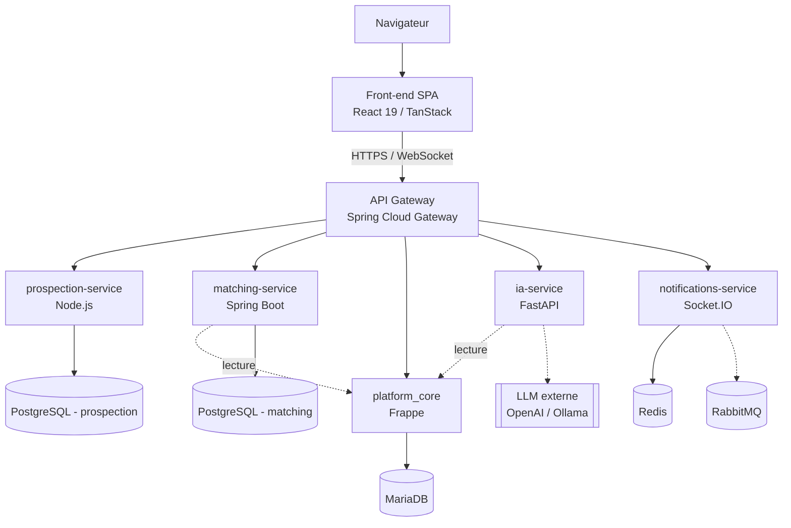

# Sortlist Maroc

Plateforme B2B de mise en relation entre **clients** et **agences** (recherche,
matching, gestion de projets, prospection et notifications), organisée en
monorepo : un front-end React, une API Gateway, un back-office métier bâti
sur **Frappe**, et quatre microservices spécialisés.

## Architecture en un coup d'œil



Le front-end ne communique **jamais** directement avec Frappe ou avec les
microservices : tout transite par l'API Gateway, qui centralise le routage et
l'authentification (JWT partagé, double validation Gateway + Frappe).

## Organisation du dépôt

| Répertoire | Rôle | Stack |
|---|---|---|
| `frontend/` | Interface utilisateur SPA | React 19, TanStack Start, Vite, TailwindCSS |
| `api-gateway/` | Point d'entrée unique et routage | Java 21, Spring Boot, Spring Cloud Gateway |
| `frappe-bench/` | Cœur métier (app `platform_core`) | Python, Frappe Framework, MariaDB |
| `matching-service/` | Scoring et mise en relation projets/agences | Java 21, Spring Boot, PostgreSQL |
| `ia-service/` | Chatbot, NLP, extraction de compétences | Python, FastAPI, OpenAI SDK / Ollama |
| `prospection-service/` | Détection de leads et prospection | Node.js, Express, PostgreSQL, SMTP |
| `notifications-service/` | Notifications temps réel | Node.js, Socket.IO, Redis, RabbitMQ |
| `infrastructure/` | Dockerfiles, Nginx, scripts SQL | Docker |
| `docs/` | Contrat d'intégration entre services | Markdown |
| `docker-compose.yml` | Orchestration locale de l'ensemble | Docker Compose |

Chaque service dispose de son propre `README.md` avec ses détails
d'exécution et ses variables d'environnement. Le contrat commun (routage,
JWT, table des ports) est documenté dans
[`docs/INTEGRATION.md`](docs/INTEGRATION.md).

## Prérequis

- Docker et Docker Compose
- Java 21 + Maven (pour développer `api-gateway` / `matching-service` hors conteneur)
- Node.js 18+ (pour `frontend`, `prospection-service`, `notifications-service`)
- Python 3.11+ (pour `ia-service`)
- Un bench Frappe existant (voir `frappe-bench/`) pour l'app `platform_core`

## Démarrage rapide (Docker Compose)

```bash
git clone <url-du-depot>
cd Sortlist_Maroc

# copier et adapter les variables d'environnement si nécessaire
cp .env.example .env   # si le fichier existe pour le service concerné

docker compose up -d --build
```

Services exposés une fois démarrés :

| Service | URL locale |
|---|---|
| Frontend | http://localhost:3000 |
| API Gateway | http://localhost:8080 |
| Frappe (`platform_core`) | http://localhost:8000 |
| matching-service | http://localhost:8081 |
| ia-service | http://localhost:8083 |
| prospection-service | http://localhost:8084 |
| notifications-service | http://localhost:8085 |
| MailHog (emails en dev) | http://localhost:8025 |
| RabbitMQ management | http://localhost:15672 |

> En développement, Frappe peut tourner hors conteneur : la Gateway et les
> microservices retombent automatiquement sur une adresse locale
> (`host.docker.internal`) si le conteneur Frappe n'est pas joignable — voir
> [`docs/FRAPPE_FALLBACK.md`](docs/FRAPPE_FALLBACK.md).

## Authentification

Connexion principale sans mot de passe par **OTP envoyé par e-mail** :
Frappe émet un JWT (HS256, secret partagé) que le front-end transmet ensuite
dans l'en-tête `Authorization: Bearer <jwt>`. L'API Gateway valide une
première fois le jeton et injecte l'identité de l'utilisateur
(`X-User-Email`, `X-User-Type`, `X-Agency-Id`) ; Frappe revalide le même
jeton à la réception, pour une défense en profondeur. Détails complets dans
`docs/INTEGRATION.md` (§3).

## Licence

Distribué sous licence MIT — voir [`license.txt`](license.txt).
